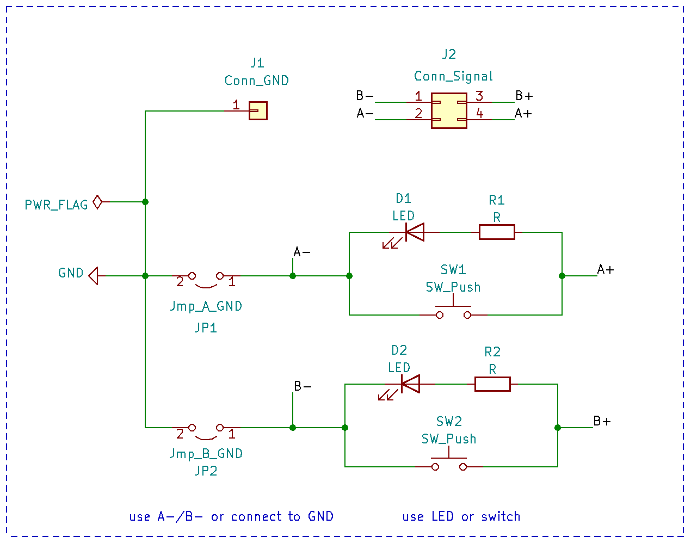
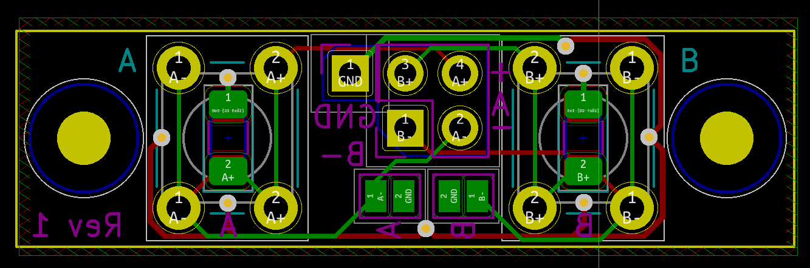

pcb-button-and-led
==================

This is a panel mountable pcb for 1-2 switches or LEDS.

Note that you can mount either an LED, or a button
on the left or right side. So this pcb supports
three different configurations.

For the LEDs you need 1206 LEDs and 1206 resistors
(on the back).

KiCAD sources are in `button-and-led.kicad`. Production
files for JLCPCB are in `production_files`.

License
-------

[![CC BY-SA 4.0][cc-by-sa-shield]][cc-by-sa]

This work is licensed under a
[Creative Commons Attribution-ShareAlike 4.0 International
License][cc-by-sa].

[![CC BY-SA 4.0][cc-by-sa-image]][cc-by-sa]

[cc-by-sa]: http://creativecommons.org/licenses/by-sa/4.0/
[cc-by-sa-image]: https://licensebuttons.net/l/by-sa/4.0/88x31.png
[cc-by-sa-shield]:
https://img.shields.io/badge/License-CC%20BY--SA%204.0-lightgrey.svg
